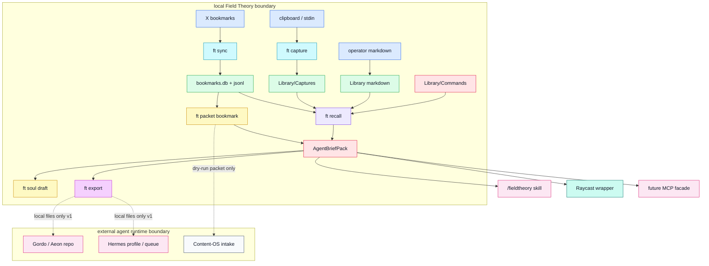
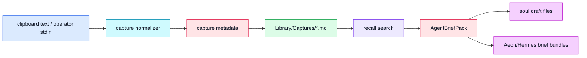
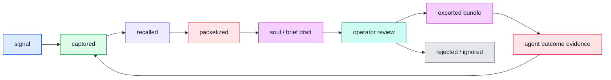
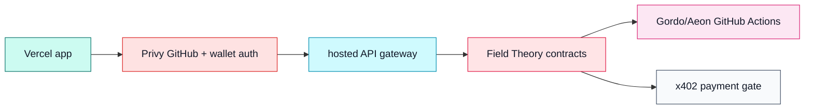

# Field Theory Capture-First Agentic Suite Architecture

> Status: draft build target. This document maps the local-first milestone that
> must exist before the Vercel/Gordo/Hermes/wallet/x402 product layer.

## 1. Working Decision

Product/system: Field Theory Capture-First Agentic Suite.

Internal modules:

- capture substrate
- recall gateway
- source packet builder
- soul draft builder
- agent export packager
- operator/Raycast/MCP wrappers

Audience: solo operator first; Aeon/Gordo and Hermes consumers second; hosted
multi-user product later.

Non-goals:

- no hosted app in this milestone
- no wallet gating in this milestone
- no live x402 payment checks
- no direct GBrain/wiki/Hermes/Gordo writes
- no direct mutation of `bookmarks.db` outside existing bookmark commands

## 2. Status Legend

| Status | Meaning |
|---|---|
| verified-command | Existing CLI command in this repo. |
| verified-store | Existing local store with tests/path guards. |
| verified-file | Existing documentation or wrapper file. |
| proposed-target | Build target for this milestone. |
| deferred-target | Later milestone after capture contracts pass. |

## 3. Core Properties

| Property | Requirement |
|---|---|
| Local-first | Raw captures, bookmarks, Library notes, and Commands stay local. |
| Evidence-first | Every pack item carries a source locator. |
| Dry-run exports | Aeon/Hermes exports write local bundles only in v1. |
| Human promotion | Wiki/GBrain/canon promotion remains outside Field Theory v1. |
| Agent-readable | JSON contracts and markdown reports are equally supported. |
| No hidden authority | Raycast, MCP, plugins, and hosted surfaces call CLI contracts. |
| Deterministic baseline | Capture, recall, packet, and export work without cloud LLMs. |

## 4. System Planes

| Plane | Components | Job |
|---|---|---|
| Data | X bookmarks, clipboard text, Library markdown, Commands | Hold raw and human-readable source material. |
| Truth/control | path guards, capture metadata, pack schema, write gates | Decide what can be written and where. |
| Agent | `/fieldtheory` skill, future MCP facade, Aeon/Gordo, Hermes | Consume bounded context and run work elsewhere. |
| Model | existing classify/wiki engines, future soul distillation | Optional synthesis, never required for raw capture. |
| Product | CLI, static console, Raycast, future Vercel app | Operator surfaces. |
| Export | soul folders, Aeon bundles, Hermes bundles, x402 handoff docs | Portable artifacts for other runtimes. |

## 5. Master Map

## 6. Capture to Learning Flow

## 7. Write Authority

| Actor | Target | Allowed writes in Milestone 1 | Forbidden writes | Gate |
|---|---|---|---|---|
| `ft capture` | `Library/Captures/` | New markdown capture files. | Existing captures without explicit update command. | Path guard + type validation. |
| `ft recall` | stdout | JSON/markdown only. | Any filesystem or remote writes. | Read-only command. |
| `ft packet` | stdout | JSON/markdown only. | Hermes, Content-OS, Gordo, wiki, GBrain writes. | Dry-run command. |
| `ft soul draft` | explicit `--out` | Soul markdown files. | Secrets, `.git`, remote repos. | Output path guard. |
| `ft export` | explicit `--repo`/`--out` | Local bundle files. | GitHub secrets, workflow dispatch, Vercel deploy. | Output path guard. |
| Raycast | local CLI | Call read-only or explicit CLI commands. | Direct DB/markdown mutation. | CLI wrapper. |
| Future MCP | local CLI | Whitelisted CLI JSON contracts. | Direct store access. | Tool schema + audit. |

## 8. Core Object Lifecycle

## 9. Storage Boundaries

| Store | Status | Truth role |
|---|---|---|
| `~/.fieldtheory/bookmarks/bookmarks.jsonl` | verified-store | Raw bookmark mirror. |
| `~/.fieldtheory/bookmarks/bookmarks.db` | verified-store | Rebuildable search index. |
| `~/.fieldtheory/library/` | verified-store | Human-readable local knowledge. |
| `~/.fieldtheory/library/Captures/` | proposed-target | Staging for clipboard/manual captures. |
| `~/.fieldtheory/library/Commands/` | verified-store | Procedure memory for operators and agents. |
| `soul/` output | proposed-target | Portable identity draft for Aeon/Hermes. |
| `fieldtheory/briefs/` export | proposed-target | Local agent handoff bundle. |
| `~/wiki` | external | Human-readable canon, not written in v1 except append-only log. |
| GBrain/Honcho | external | Long-term memory systems, no v1 writes. |

## 10. MVP Spine

1. Capture clipboard/stdin into Library/Captures with metadata.
2. Recall captures, Library, Commands, and bookmarks into `AgentBriefPack`.
3. Convert one bookmark into a target-specific dry-run source packet.
4. Draft editable soul files from local Field Theory sources.
5. Export local Aeon/Hermes bundles with no remote side effects.
6. Update skill/Raycast/docs so agents use the new contracts.

## 11. Deferred Hosted Layer

The Vercel suite should treat CLI contracts as the backend truth:

Build verdict: the highest-leverage next module is `ft capture`, because it
creates the local learning substrate every other agentic surface depends on.

Milestone 2 starts from `docs/handoff/hosted-suite-milestone-2.md`, populated
with real Milestone 1 smoke outputs. Until that file contains actual
`agent-brief-pack.v1` and export manifest samples, Vercel, Privy wallet gating,
Gordo/Aeon live control, Hermes writeback, GitHub Actions deployment, and x402
enforcement remain out of scope.
