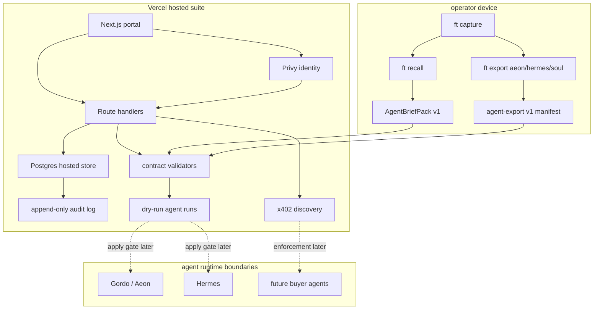
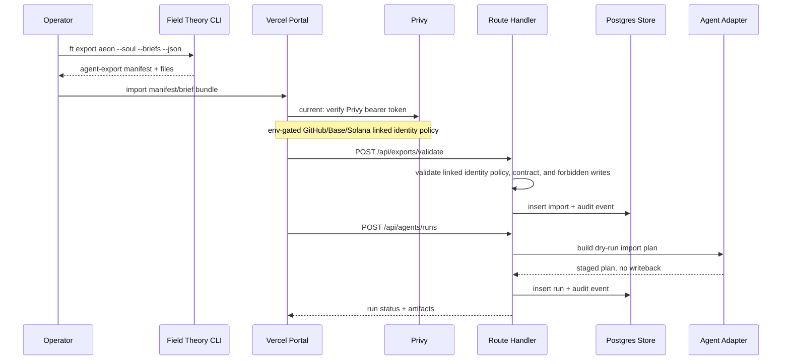
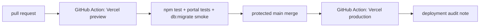

# Field Theory Hosted Agentic Suite Architecture

## Working Decision

The hosted suite is a control plane over Field Theory artifacts, not a new source
of truth. The portal consumes validated `AgentBriefPack` and export manifests,
then produces audited plans for Aeon/Gordo, Hermes, and future x402 endpoints.

## System Planes

| Plane | Components | Authority |
|---|---|---|
| Local Field Theory | CLI stores, captures, recall packs, export bundles | Owns raw capture and source provenance. |
| Hosted portal | Next.js UI, route handlers, validators, Postgres store | Owns review, auth, staged run plans, and hosted audit metadata. |
| Auth | Privy GitHub, Base EVM wallet, Solana wallet | Owns identity proof and account linking. |
| Agent adapters | Gordo/Aeon import plan, Hermes import plan | Emit dry-run plans until apply gates are added. |
| Deployment | Vercel project plus GitHub Actions | Owns preview/production build and deploy. |
| Payment | x402 discovery and later protected endpoints | Deferred until architecture and security review pass. |

## Master Map

## Hosted API Flow

## Endpoint Boundary

| Boundary | Rule |
|---|---|
| Public endpoints | May expose health, contract versions, and x402 discovery only. |
| Authenticated endpoints | Require Privy session and user ownership of imported artifacts. |
| Agent endpoints | Require scoped token or Privy-backed session mapped to the run owner. |
| Apply endpoints | Must remain unimplemented or disabled until a separate apply-gate PR. |
| x402 endpoints | Must return discovery/challenge fixtures only until payment replay and audit are approved. |

## Write Authority

| Actor | Allowed in M2 | Forbidden in M2 |
|---|---|---|
| Portal UI | Upload/import manifests, show plans, create dry-run runs | Direct filesystem access to operator stores. |
| Route handlers | Validate contracts, write audit log, store run metadata through `HostedStore` | Git pushes, Vercel deploy calls, GitHub secret writes, Hermes writeback. |
| Gordo adapter | Generate apply plan from export bundle | Create repos, write workflows, dispatch GitHub Actions. |
| Hermes adapter | Generate staged task payload preview | Mutate Hermes Kanban/profile state. |
| x402 module | Publish endpoint inventory and test fixtures | Enforce payment or settle funds. |

## Proposed Route Handlers

| Route | Runtime | Notes |
|---|---|---|
| `app/api/health/route.ts` | nodejs | Must not require secrets. |
| `app/api/contracts/route.ts` | nodejs | Returns contract versions and schema fingerprints. |
| `app/api/briefs/validate/route.ts` | nodejs | Calls shared validator package. |
| `app/api/exports/validate/route.ts` | nodejs | Checks manifest paths and forbidden writes. |
| `app/api/agents/route.ts` | nodejs | Lists configured targets and disabled apply status. |
| `app/api/agents/runs/route.ts` | nodejs | Creates dry-run plans only. |
| `app/api/agents/runs/[id]/route.ts` | nodejs | Reads run status and audit envelope. |
| `app/api/gordo/import-plan/route.ts` | nodejs | Builds Aeon/Gordo import plan from manifest. |
| `app/api/hermes/import-plan/route.ts` | nodejs | Builds Hermes import plan from task payload. |
| `app/api/x402/discovery/route.ts` | nodejs | Lists planned paid endpoints and policy status. |

## Storage Model

M2 uses a small typed persistence layer. Memory is local/test only. Postgres is
selected by `DATABASE_URL`; production requires schema version `1` from
`npm --prefix apps/portal run db:migrate`. Import/audit and run/audit writes go
through composite store methods so durable writes are transactional.

| Store | Contents |
|---|---|
| `users` | Planned: Privy user id, GitHub identity, linked EVM/Solana wallet summaries. |
| `fieldtheory_imports` | Uploaded/imported contract metadata, hashes, owner id, validation status. |
| `fieldtheory_agent_runs` | Dry-run plan, target, status, owner id, result envelope. |
| `fieldtheory_audit_events` | Append-only event log with actor, target, contract hash, and outcome. |
| `x402_endpoint_plans` | Planned endpoint id, price policy, facilitator assumptions, enforcement status. |

## Deployment Flow

Vercel's current GitHub Actions guidance uses `vercel pull`,
`vercel build`, and `vercel deploy --prebuilt`, with separate preview and
production workflows.

## Open Decisions

| Decision | Default until decided |
|---|---|
| Database provider | Postgres via `DATABASE_URL`; backup/restore and migration versioning still need release gates. |
| Agent execution location | Vercel owns control plane; long-running work may need GitHub Actions or external worker. |
| x402 facilitator | Document assumptions only; no enforcement. |
| Apply gates | Dry-run only until a human-reviewed apply plan exists. |
| Secret ownership | GitHub/Vercel/Privy secrets are operator-managed and never stored in Field Theory captures. |
