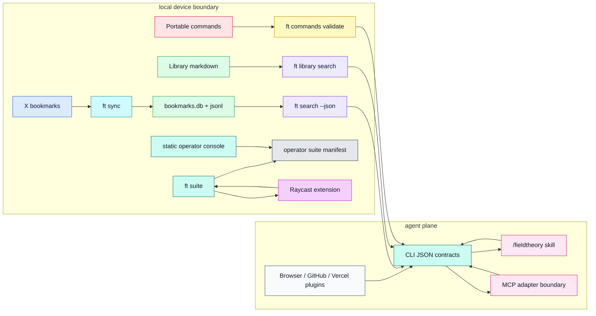
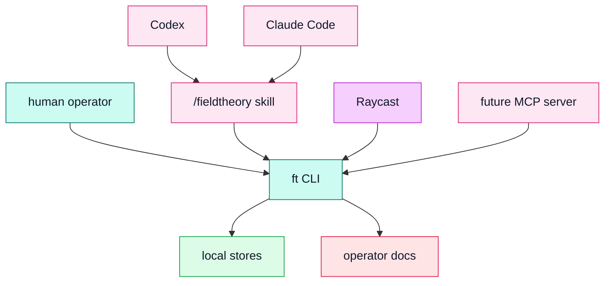
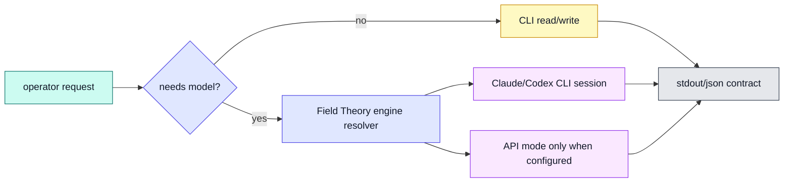

# Field Theory Operator Suite Architecture

Status: implemented documentation plus CLI-backed operator surfaces.
Audience: solo AI operators, coding agents, and local-first workflows.

## Working Decision

Field Theory stays terminal-first. The operator suite adds product surfaces
around the existing CLI without creating a second source of truth.

| Surface | Status | Authority |
|---|---|---|
| `ft suite` CLI group | verified-command | reads and scaffolds local artifacts |
| Static operator console | verified-file | read-only browser surface |
| Raycast extension | verified-file | wraps CLI commands; no direct data store writes |
| MCP adapter boundary | proposed-target | should call CLI JSON contracts first |

## Status Legend

| Status | Meaning |
|---|---|
| verified-command | implemented as a CLI command in this repo |
| verified-file | implemented as a repository artifact |
| proposed-target | documented boundary for a future implementation |

## Master Map



## Planes

| Plane | Owns | Does not own |
|---|---|---|
| Data | bookmark cache, markdown library, command files | model decisions |
| Truth/control | command validation, write gates, local paths | upstream wiki canon gates |
| Agent | `/fieldtheory` skill and future MCP facade | direct store mutation |
| Model | existing classify/ask/possible engines | hidden provider routing |
| Product | CLI, static console, Mac app deep links | private raw transcript promotion |
| Extension | Raycast and plugin manifests | independent data authority |

## Agent Topology



## Write Authority

| Actor | Target | Allowed writes | Forbidden writes | Gate |
|---|---|---|---|---|
| CLI user | Library | create/update/delete via explicit command | silent canon promotion | command invocation |
| CLI user | Commands | create/update/delete and validate | bypass validation on release artifacts | `ft commands validate` |
| Agent skill | Local stores | none by default; recommends CLI calls | raw filesystem mutation | operator instruction |
| Raycast | Local stores | none by default | direct markdown/database writes | CLI wrapper only |
| Future MCP | Local stores | call whitelisted CLI JSON contracts | direct DB writes | tool schema + audit |

## Model Routing



## MCP Boundary

Future MCP tools should stay thin:

```json
{
  "tool": "fieldtheory.search",
  "input": { "query": "agent memory", "limit": 10 },
  "exec": ["ft", "search", "agent memory", "--limit", "10", "--json"],
  "authority": "read-only",
  "output": "Field Theory search JSON"
}
```

No MCP server should write directly to SQLite or markdown stores. Writes go
through explicit CLI commands with the same conflict checks operators use.

## MVP Spine

1. Read local status through `ft suite status --json`.
2. Open the static console for a browser-readable operator map.
3. Launch Raycast commands that call the CLI instead of reimplementing data access.
4. Promote repeated workflows into portable commands or skills.
5. Add MCP later as a thin facade over the same JSON contracts.

