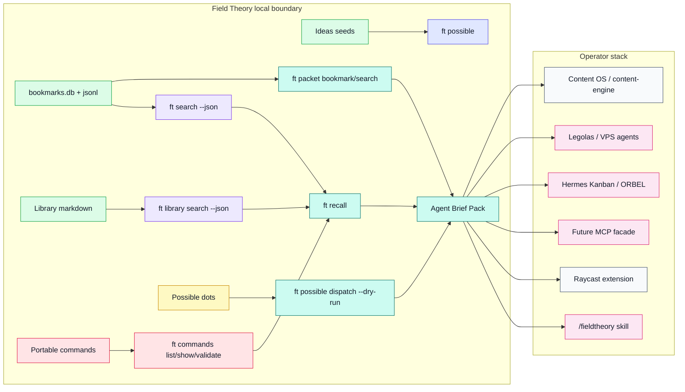
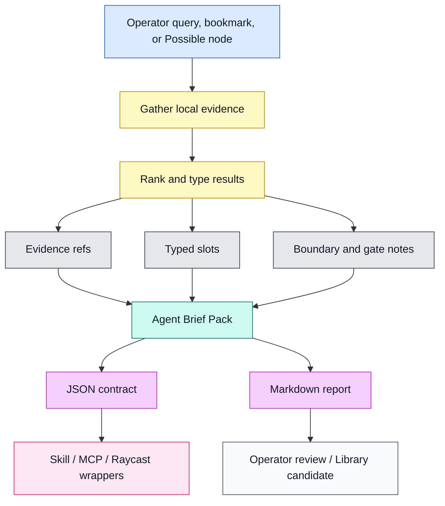
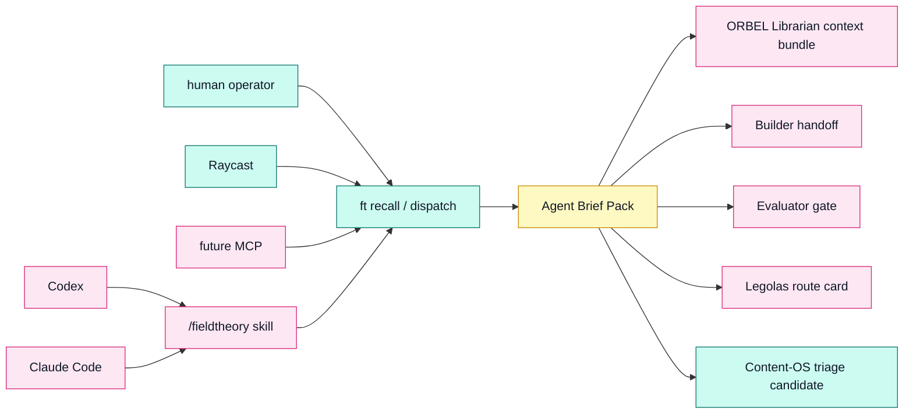
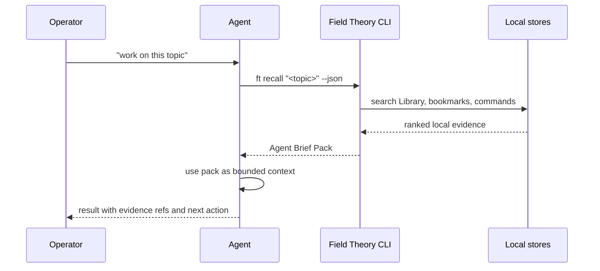
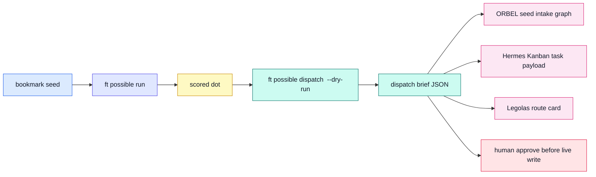
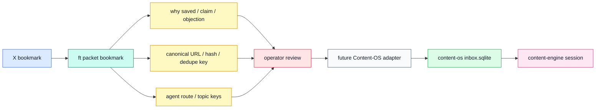

# Field Theory Agent Brief Packs

Status: proposed feature plan.
Audience: solo AI builders, operator agents, Hermes/ORBEL fleets, and future MCP/Raycast wrappers.

## Working Decision

Build **Agent Brief Packs** as the next Field Theory feature.

Implementation must start with the capture-first foundation documented in:

- `docs/prd/capture-first-agentic-suite.md`
- `docs/setup/capture-first-environment.md`
- `docs/architecture/capture-first-agentic-suite.md`
- `docs/superpowers/plans/2026-05-31-fieldtheory-capture-first-agentic-suite.md`

The hosted Vercel, Gordo/Aeon control plane, Hermes writeback, wallet gating,
and x402 layers are explicitly downstream of the local capture, recall, packet,
soul, and export contracts.

An Agent Brief Pack has three related shapes:

1. `recall_pack`: a JSON-first, read-only `ft recall <query>` command that
   gathers Library notes, bookmarks, and matching portable commands into one
   typed, evidence-linked context packet for agents.
2. `source_packet`: a bookmark-centered packet that adds why-saved intent,
   claim support, topic keys, source identity, dedupe hints, and agent routing
   metadata before the item enters Content-OS or content-engine.
3. `dispatch_brief`: a Possible-dot packet that turns an already scored idea
   into a dry-run work handoff for Hermes Kanban, ORBEL, Factory Swarm, or
   Legolas/VPS workers.

The first implementation should stabilize the shared pack schema through
`ft recall`. The next slice should enrich bookmark source packets for
Content-OS. Dispatch comes after those packets can reliably carry provenance,
gates, and result-envelope expectations.

This should not become another idea engine. Field Theory already has seeds,
Possible, dots, implementation prompts, Library, Commands, Raycast, and the
operator suite. The missing layer is the handoff object that converts saved
signals into bounded agent work without losing provenance.

## Evidence From Current Stack

| Source | Relevant fact | Design implication |
|---|---|---|
| Field Theory CLI | Bookmarks, Library, Commands, seeds, Possible, skills, Raycast, and suite docs already exist. | Compose existing stores; do not create a second storage layer. |
| Possible pipeline | Dots already carry `exportablePrompt` and optional `implementationPrompt`. | Dispatch briefs should reuse those prompts rather than regenerate strategy. |
| KnowledgeOS doctrine | GBrain holds durable memory, wiki holds canon, skills hold procedures, Kanban holds run-local state. | Brief packs need typed slots and explicit promotion targets. |
| Content OS | Raw captures live in staging; approved items move through audit and promotion gates. Live inbox has 6,996 pending rows; 1,780 `killersquad-twitter-bookmarks` rows have empty `source_metadata_json`. | Bookmark source packets should populate intent/routing metadata before triage. |
| content-engine | Useful agent work leaves file artifacts in `sessions/<date-slug>/`. | Brief packs should be persistable and reviewable as markdown plus JSON. |
| ORBEL / Hermes Kanban | Agent fleets need task packets with board, assignee, gate, verification, and result envelope. | Dispatch starts as dry-run JSON, then can wrap live Kanban later. |
| Legolas / VPS agents | Fleet gateway should route, observe, and report; it should not own product truth. | Briefs should embed enough context for remote workers without granting direct store writes. |

## Product Shape

Agent Brief Packs are typed, source-linked packets produced by the CLI.

They answer three operator questions:

1. What does my local Field Theory know about this?
2. What should an agent read or run next?
3. If this becomes work, what safe dispatch packet should enter the fleet?

### Command Surface

```bash
ft recall "agent memory infrastructure" --json
ft recall "agent memory infrastructure" --md
ft recall "agent memory infrastructure" --captures 5 --library 5 --bookmarks 8 --commands 3

ft packet bookmark <bookmark-id> --target content-os --json

ft possible dispatch <node-id> --target hermes-kanban --board orbel --dry-run --json
ft possible dispatch <node-id> --target legolas --tier scout --dry-run --md
```

`ft recall` is the schema MVP. `ft packet bookmark` is the Content-OS bridge
and is dry-run by design in v1. `ft packet search` and `ft possible dispatch`
come after those are stable and should use a separate dispatch target enum.

### Non-goals

- No direct writes to `bookmarks.db`, Library markdown, Commands, Hermes
  Kanban, GBrain, wiki canon, or remote VPS state.
- No replacement for `ft possible`, `ft seeds`, or `ft commands`.
- No live Kanban mutation in v1. Dispatch is a dry-run export until explicit
  write gates and tests exist.
- No direct writes into Content-OS SQLite in v1. Source packets emit dry-run
  payloads until a Content-OS-owned adapter accepts them.
- No bulk import of raw X/Readwise/private corpora into wiki or GBrain.

## Master Map



## Data Flow



## Agent Topology



## Storage And Truth Boundaries

| Target | v1 authority | Notes |
|---|---|---|
| Bookmarks | read-only | Use existing bookmark search/index APIs. |
| Library | read-only except `ft capture` writes to `Library/Captures/` | Later `--save` may create a Library page through existing conflict-safe Library commands. |
| Commands | read-only for MVP | Suggest commands; do not create them automatically. |
| Possible | read existing seeds/runs/dots | Reuse `implementationPrompt` and `exportablePrompt`. |
| Hermes Kanban | dry-run only | Emit task-create payloads; no live mutations in v1. |
| GBrain | no direct v1 write | Future MCP can ingest promotion candidates after explicit gates. |
| Wiki canon | no direct write | Use wiki-ingest/content-engine promotion rules outside Field Theory. |
| VPS/Legolas | dry-run only | Emit route card; Legolas remains the orchestrator. |

## Pack Schema

The canonical v1 TypeScript contract is frozen in
`docs/superpowers/plans/2026-05-31-fieldtheory-capture-first-agentic-suite.md`.
This feature note keeps the same shape at the planning level so PRD, CLI,
MCP/Raycast wrappers, and future hosted surfaces do not fork the contract.

```ts
interface AgentBriefPack {
  id: string;
  version: "agent-brief-pack.v1";
  kind: "recall_pack" | "source_packet" | "dispatch_brief";
  generatedAt: string;
  input: PackInput;
  limits: PackLimits;
  storeStatus: StoreStatusEntry[];
  query?: string;
  sourceBookmarkId?: string;
  sourceNodeId?: string;
  summary: string;
  summaryClaims: SummaryClaim[];
  evidence: EvidenceItem[];
  typedSlots: TypedSlot[];
  sourcePacket?: SourcePacket;
  suggestedCommands: SuggestedCommand[];
  boundaries: BoundaryNote[];
  promotionCandidates: PromotionCandidate[];
  resultEnvelope: ResultEnvelope;
}

interface SourcePacket {
  target: "aeon" | "hermes" | "content-os";
  agentRoute:
    | "build_handoff"
    | "recon_candidate"
    | "synthesis_evidence";
  sourceId: string;
  sourceUrl?: string;
  whySavedStatus: "known" | "inferred" | "unknown";
  confidence: number;
  forbiddenActions: string[];
  payload: Record<string, unknown>;
}

`SourcePacket.forbiddenActions` is the authoritative safety list. Target
payloads must not include a nested `forbiddenActions` key. Content-OS payloads
use `topicKeys`, `tags_json`, `source_metadata_json`, `links_json`,
`dedupeKey`, `sourceIdentity`, `nextAction`, and `adapterRequired`.

interface BoundaryNote {
  id: string;
  authority: "local-only" | "dry-run" | "external-gated";
  gate: string;
  rule: string;
  reason: string;
  forbiddenActions: string[];
  evidenceIds: string[];
}

interface EvidenceItem {
  id: string;
  sourceType: "capture" | "library" | "command" | "bookmark" | "operator";
  title: string;
  locator: string;
  excerpt: string;
  hash?: string;
  rank: number;
  sourceRank: number;
  score: number;
  scoreReason: string;
  retrievedAt: string;
  capturedAt?: string;
  tags: string[];
}

interface TypedSlot {
  type: "context" | "constraint" | "command" | "idea" | "soul" | "source";
  label: string;
  value: string;
  evidenceIds: string[];
  operatorAuthored?: boolean;
}

interface SuggestedCommand {
  command: string;
  argv: string[];
  reason: string;
  evidenceIds: string[];
  operatorAuthored?: boolean;
}

interface PromotionCandidate {
  destination: "library" | "wiki" | "gbrain" | "skill" | "none";
  status: "candidate" | "blocked" | "not_recommended";
  reason: string;
  evidenceIds: string[];
}

interface ResultEnvelope {
  status: "complete" | "partial";
  resultCount: number;
  warnings: string[];
  generatedBy: "fieldtheory";
}
```

## Workflow 1: Recall Before Agent Work



## Workflow 2: Bookmark Seed To Fleet Dispatch



## Workflow 3: Bookmark To Content-OS Source Packet

The pack can also produce a Content-OS source packet without bypassing
Content-OS:

1. `ft packet bookmark <id> --target content-os --json` builds a dry-run packet
   with `whySavedStatus`, `confidence`, `agentRoute`, evidence locators,
   `dedupeKey`, `sourceIdentity`, and target payload fields.
2. Operator reviews whether it belongs in Content-OS.
3. A future Content-OS-owned adapter can accept the payload and populate
   `tags_json`, `topicKeys`, `source_metadata_json`, and `links_json` in
   its own SQLite schema.
4. content-engine may later consume the approved topic through its existing
   session directory contract.



## MCP And Raycast Implications

Future MCP tools stay thin:

```json
{
  "tool": "fieldtheory.recall",
  "input": { "query": "agent memory", "library": 5, "bookmarks": 8, "commands": 3 },
  "exec": ["ft", "recall", "agent memory", "--json"],
  "authority": "read-only"
}
```

Raycast should call the CLI and render the resulting markdown/JSON. It should
not parse SQLite, modify Library markdown, or create Kanban tasks directly.

## MVP Implementation Plan

### Phase 1: `ft recall`

Files likely touched:

- `src/recall.ts`: `buildRecallPack()` and markdown formatter.
- `src/cli.ts`: register `ft recall <query>`.
- `src/skill.ts`: teach agents to prefer `ft recall --json` before separate searches.
- `README.md`: document the command as an agent integration surface.
- `docs/workflows/operator-suite.md`: update the recall workflow.
- `tests/recall.test.ts`: temp data dirs and deterministic fixture coverage.

Acceptance:

- Returns valid JSON when bookmarks DB is missing, Library is empty, or Commands
  are absent.
- Preserves source locators for every evidence item.
- Separates read-only suggestions from write-with-intent suggestions.
- Produces markdown that can be pasted into an agent or reviewed by an operator.

### Phase 2: Bookmark Source Packet Dry-run

Files likely touched:

- `src/source-packets.ts`: source packet construction and markdown formatter.
- `src/cli.ts`: register `ft packet bookmark` and `ft packet search`.
- `README.md`: document the Content-OS dry-run bridge.
- Tests with bookmark fixtures and missing metadata.

Acceptance:

- Reads one bookmark or a bounded bookmark search result set.
- Emits Content-OS-compatible metadata without writing to Content-OS.
- Produces stable `dedupeKey` and `sourceIdentity` fields.
- Makes weak/unknown `whySaved` explicit instead of hallucinating operator
  intent.

### Phase 3: Dispatch Brief Dry-run

Files likely touched:

- `src/ideas.ts` or a new `src/dispatch-brief.ts`.
- CLI route under `ft possible dispatch`.
- Tests using existing dot fixtures.

Acceptance:

- Reads an existing Possible node/dot.
- Emits Hermes Kanban, ORBEL, and Legolas target shapes without live writes.
- Requires `--dry-run` for every dispatch invocation when this deferred phase is
  promoted into its own contract.
- Includes forbidden actions, human gates, and verification instructions.

### Phase 4: Operator Suite Reflection

- Add the new command to `ft suite status --json`.
- Add Raycast read-only command to render recall packs.
- Add future MCP schema examples.

### Phase 5: Promotion Gates

Only after v1 is stable:

- `ft recall --save-library <path>` through existing Library conflict checks.
- `ft packet ... --target content-os --write` only through a Content-OS-owned
  import adapter, never direct SQLite writes from Field Theory.
- `ft possible dispatch --target hermes-kanban --write` only behind explicit
  confirmation and tests.
- GBrain/wiki promotion stays outside Field Theory unless a dedicated adapter
  owns the gate.

## Validation Gates

| Gate | Command |
|---|---|
| Type/build | `npm run build` |
| Unit tests | `npm test` |
| Contract fixture | `node --test tests/recall.test.ts` |
| CLI smoke | `ft recall "agents" --json` |
| Docs drift | `ft suite workflows` includes the same workflow language as docs |
| Safety review | No code path writes outside existing CLI write commands |

## Risk Register

| Risk | Mitigation |
|---|---|
| Brief packs become another noisy memory dump | Keep evidence limits, typed slots, and source locators mandatory. |
| Agents treat suggestions as authority | Mark every suggested command with authority and gate. |
| Dispatch bypasses Hermes/Kanban safety | v1 is dry-run only; live writes require a separate milestone. |
| GBrain/wiki promotion gets faked | Emit promotion candidates only; leave actual writes to existing gates. |
| Possible and recall overlap | `ft recall` answers "what do we know"; `ft possible` answers "what could we build". |

## Why This Opens A New Door

Field Theory already captures attention. Agent Brief Packs turn attention into
bounded execution context.

For a solo builder with many agents, this is the leverage point: every agent can
start from the same compact, sourced packet instead of redoing recall, guessing
boundaries, or copying raw bookmark text into a prompt. It bridges bookmarks,
KnowledgeOS, Content-OS, ORBEL, Hermes Kanban, and VPS workers while keeping
each system's authority intact.
