# Field Theory Operator Workflows

These workflows describe how AI agents and human operators should use Field
Theory without bypassing local truth boundaries.

## Workflow Loop

```mermaid
flowchart LR
  Discover["discover paths/status"]:::surface --> Recall["recall evidence"]:::recall
  Recall --> Package["package command"]:::truth
  Package --> Validate["validate command"]:::worker
  Validate --> Install["install skill"]:::agent
  Install --> Operate["Raycast / CLI operate"]:::surface
  Operate --> Promote["promote durable note"]:::truth
  Promote --> Recall

  classDef surface fill:#ccfbf1,stroke:#0f766e,color:#111827;
  classDef recall fill:#ede9fe,stroke:#7c3aed,color:#111827;
  classDef truth fill:#ffe4e6,stroke:#e11d48,color:#111827;
  classDef worker fill:#fef9c3,stroke:#ca8a04,color:#111827;
  classDef agent fill:#fce7f3,stroke:#db2777,color:#111827;
```



## Standard Workflows

| Step | Gate | Command | Output |
|---|---|---|---|
| Discover local context | read-only | `ft paths --json && ft status --json` | Canonical paths and local collection health. |
| Recall evidence | read-only | `ft library search <query> --json && ft search <query> --json` | Durable notes first, bookmark evidence second. |
| Package reusable procedure | write with operator intent | `ft commands new <name> --stdin && ft commands validate <name>` | Validated portable command in the local Commands store. |
| Expose to coding agents | install writes only | `ft skill install` | Claude Code and Codex procedure memory updated. |
| Operate from launcher | read-only by default | `ft suite raycast scaffold --out ./raycast/fieldtheory` | Raycast extension that wraps CLI commands without new data authority. |
| Promote durable doctrine | human canon gate | `ft library create <path> --stdin` | Human-readable markdown artifact; wiki canon stays separately gated. |

## Capture-First Workflow

Milestone 1 local contracts build the Field Theory learning substrate before any
hosted Vercel, wallet, Gordo, Hermes, or x402 layer.

| Stage | Build gate | Command target | Boundary |
|---|---|---|---|
| Capture signal | local Library write | `ft capture clipboard --type note\|source\|idea\|soul` and `ft capture text --stdin --type ...` | Writes only to `Library/Captures/`. |
| Recall context | read-only | `ft recall <query> --json\|--md` | Reads bookmarks, Library, Captures, and Commands. |
| Packet source | dry-run | `ft packet bookmark <id> --target aeon\|hermes\|content-os` | Emits packet only; no target-system write. |
| Draft identity | explicit output path | `ft soul draft --from bookmarks,library,clipboard --out soul/` | Creates editable soul files from bookmarks, Library notes, and stored Captures. |
| Export handoff | explicit output path | `ft export aeon\|hermes\|soul ...` | Local files only; no GitHub secrets or workflow dispatch. |

Smoke sequence after the CLI is installed. During branch validation, use the
full isolated `npm run --silent dev -- ...` smoke in
`docs/setup/capture-first-environment.md`.

The `bm_test` examples below require the seeded bookmark fixture from the setup
runbook. Use the full setup smoke when validating a fresh environment.

```bash
printf 'agent note\n' | ft capture text --stdin --type soul --json
ft recall agent --json
ft packet bookmark bm_test --target aeon --json
ft soul draft --from bookmarks,library,clipboard --out ./soul --json
ft export aeon --repo ./aeon-export --query agent --bookmark bm_test --soul --briefs --json
ft export hermes --out ./hermes-export --query agent --bookmark bm_test --briefs --json
ft export soul --out ./soul-export --json
```

`--from clipboard` reads prior clipboard captures staged under
`Library/Captures/`; it does not read the live clipboard. Use
`ft capture clipboard --type ...` first when the current clipboard should become
source material.

Foundation docs:

- PRD: `docs/prd/capture-first-agentic-suite.md`
- Environment: `docs/setup/capture-first-environment.md`
- Architecture: `docs/architecture/capture-first-agentic-suite.md`
- Build plan: `docs/superpowers/plans/2026-05-31-fieldtheory-capture-first-agentic-suite.md`

## Browser Verification Workflow

The static app is intentionally dependency-free:

1. Open `apps/operator-suite/index.html` in a browser.
2. Confirm the first viewport shows Field Theory Operator Suite, command status,
   MCP/skills/plugins planes, Raycast cards, and workflow gates.
3. Confirm the page has no network dependency and all labels are code-native text.
4. Use `ft suite status --json` as the data contract for future dynamic wiring.

## Raycast Workflow

1. Install Raycast developer tools.
2. Run `ft suite raycast scaffold --out ./raycast/fieldtheory --force` to refresh
   the extension from CLI templates.
3. Open `raycast/fieldtheory` and run `npm install`.
4. Run `npm run dev`.
5. Set the `ft binary` preference if the CLI is not on Raycast's PATH.

The extension calls `ft`; it does not own persistence.

## MCP Workflow

Future MCP work should start with read-only tools:

| Tool | CLI backing | Authority |
|---|---|---|
| `fieldtheory.status` | `ft suite status --json` | read-only |
| `fieldtheory.search` | `ft search <query> --json` | read-only |
| `fieldtheory.library_search` | `ft library search <query> --json` | read-only |
| `fieldtheory.commands_list` | `ft commands list --json` | read-only |
| `fieldtheory.command_validate` | `ft commands validate <name> --json` | read-only validation |

Write tools can come later, but only as wrappers around existing CLI write
commands with explicit arguments and audit output.
